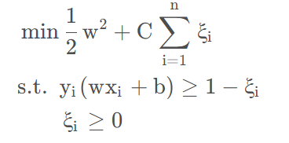

## 实验环境

- python 3.7
- scikit-learn 0.22.1
- cuda 11.3
- pytorch 1.8

## 运行代码

`python main.py --version [version] --model [model] --train [0/1] --vec [vectorize-method]`

示例：

```shell
# 测试随机森林01版本并输出测试结果：
python main.py --version 01 --model rf --train 0
```

输出保存在 log/rf_01.txt

```shell
# 用cbow抽取文本特征，并训练mlp, 设置版本为02
python main.py --version 02 --model mlp --train 1 --vec cbow
```

训练时输出保存在 log/mlp_02.txt

**具体参数含义可见 main.py**

## 数据预处理

在 dataloader.py 中，实现了去除停用词和标点, 以及全部转为小写。停用词使用的是 sklearn 自带的`ENGLISH_STOP_WORDS`, 标点是`',','.','(',')',';',':','[',']','{','}'`。bert并没有预处理。

## 数据集划分

所给带标签的数据共 8000 条，打乱后划分数据集，训练集 6400 条，测试集 1400 条，随机森林、逻辑回归、svm 使用交叉验证，mlp 从训练集抽取 2\*batchsize 作为验证集（在 mlp.py 中实现）。预处理并划分后的数据保存在 pkl 文件中方便后续使用。

## tf-idf 向量化

在 dataloader.py 的 vectorize 函数中，我用 sklearn 实现了 tf-idf 的文本特征抽取。首先，使用 sklearn 的 CountVectorizer 提取 1-gram 和 2-gram，使用正则表达式`r'\b\w+\b'`匹配单词边界；然后使用刚刚划分的训练集来 fit 这个 CountVectorizer，这样任意文本通过该 CountVectorizer 之后，得到的向量长度都相同。最后用 TfidfTransformer 将刚刚得到的词频统计，通过 tf-idf 公式转换为词向量，向量化就完成了。

在 dataloader 中，我还实现了加载训练集和验证集的接口，方便后续调用和模块化管理。

## tf-idf+随机森林

在 models.py 中，根据运行时指定的参数，训练或测试模型。当`train` 指定为 1 时，就进行参数搜索、交叉验证和模型保存。

sklearn 中随机森林的对模型影响较大的参数是：`n_estimators`,`max_depth`,`min_samples_leaf`,`min_samples_split`。调整这些参数。

```python
model = 'rf'

clf_dict = {'rf': RandomForestClassifier(),
            }

tuned_parameters = {
    'rf':[{'n_estimators': [3, 50, 100, 150],
            'max_depth': [3, 12, 24, 30, None],
            'min_samples_leaf': [1, 3, 8, 16, 22], 'min_samples_split': [2, 4, 6, 12, 24]},
          ],
}

clf = GridSearchCV(clf_dict[model],
tuned_parameters[model],
scoring='accuracy',
cv=5)
```

调参结果保存在 log 文件夹。

我一共修改了 3 次随机森林的参数空间，每次调参 验证集上 acc 最高的参数组合如下：

| version | n_estimators | max_depth  | min_samples_leaf | min_samples_split | val_acc |
| :-----: | :----------: | :--------: | :--------------: | :---------------: | :-----: |
|   02    | 100（默认）  | None(默认) |        2         |         6         |  0.909  |
|   03    |      30      |     9      |        2         |        12         |  0.730  |
|   04    |     150      |    None    |        3         |         4         |  0.909  |

发现 n_estimators 参数总是倾向于选择参数空间中最大的那个。这可能是因为随机森林中的每棵树都是通过不同的随机子集构建的，因此每棵树都会对数据的不同方面进行建模；增加树的数量会考虑到更多不同的训练样本，减小个别树可能存在的误差，从而使整体模型更加鲁棒和稳定，准确率提高。但 n_estimators 如果太大，会使模型过于复杂，可能引起过拟合。
为了验证以上想法，我在 version04 的基础上继续增大 n_estimators（[200, 250, 350, 600]）, 其余三个参数和 version04 一致，发现随着 n_estimators 从，验证集 acc 从 0.906 稳步提升至 0.910， 并未出现过拟合现象，但也没有明显的准确率提升。但在 log/rf_06.txt 中，记录到了一次 val_acc 略微下降的实验，说明有一点过拟合迹象。
一般来说，max_depth 设置成 none 会让树不受限制地生长，导致泛化能力降低。而这里 max_depth 倾向于选择 none（见 log/tf_06.txt, max_depth 越大，效果越好），可能是因为我的文本向量维度太高，树深度太浅不能充分表达这种复杂关系；而且我的维度远超过了样本数量，这可能是不容易过拟合的一个原因。

综上，随机森林调参完毕，最好的模型是 version02，测试集上准确率 0.914， f1 值 0.9129。

## tf-idf+逻辑回归
逻辑回归是将线性函数的结果映射到了Sigmoid函数中，
$$
y = \frac{1}{1+e^{(-w^Tx+b)}}
$$
Sigmoid 函数输出总是在0-1之间。
对逻辑回归的调参主要是对正则化强度和正则化方式。

## tf-idf+svm

对 svm 的调参主要是对正则化强度和核函数。
从实验结果（log/svm_01.txt）看，
| version | C | kernel | val_acc |
| :-: | :-: | :-: | :-: |
| 01 | 1 | linear | 0.925 |
| 01 | 10 | linear| 0.925 |
| 01 | 100 | linear | 0.925 |
| 01 | 1000 | linear | 0.925 |

linear 核表现最好，而此时正则化强度似乎没有影响；Sigmoid 和 rbf 在特定正则化时表现较好（详见 log/svm_01.txt）。

linear 核在这里表现好，说明样本是近似线性可分的，这可能与 tf-idf 表示的文本向量是稀疏矩阵相关。

正则化强度在线性核时似乎没有影响，这可能和数据集的分布特性有关。svm 中，参数 C 是惩罚参数。
$$
min\space \frac{1}{2C}||w||^2 + max(0, 1-y_i(wx_i+b))
$$
也即


C 越大，相当于惩罚松弛变量，希望松弛变量接近 0，即对误分类的惩罚增大，趋向于对训练集全分对的情况，这样对训练集测试时准确率很高，但泛化能力弱。C 值小，对误分类的惩罚减小，允许容错，将他们当成噪声点，泛化能力较强。而我的实验 C 的变化没有对模型效果产生影响，可能是因为我的模型在分离超平面附近没有噪声点。
为了验证以上分析，我继续在线性核上增大 C 到 1e12, 又调小 C 到 1e-2，验证集准确率都有少量下降（见 log/svm_02.txt, log/svm_03.txt），说明模型分布出现了过拟合和欠拟合。

Sigmoid 在这里表现不如线性核，可能是因为没有调整参数coef0.

综上，svm 调参完毕，最好的模型是 version02，测试集上准确率 0.928， f1 值 0.929。

## tf-idf+mlp

在 mlp.py 中，我用 pytorch 实现了一个两层结构的多层感知机，中间用一个激活函数连接。
$$
y = f(X_{(6400\times 310271)}W_1_{(310271\times hn)})W_2_{(hn\times 10)}
$$
模型输入向量化的文本特征，输出一个 10 维向量，分类结果就是 10 维中最大的那一维对应的类别。

损失函数使用多分类常用的交叉熵损失，且后续时损失函数一直是交叉熵。

mlp 使用了早停策略作为防止过拟合的方式之一。定义“生成损失”为验证集上损失除以验证集上最小损失-1：

$$
gen_loss = total_val_loss/minloss - 1
$$

当 gen_loss 两次大于 0.0002 时(patient=2)，模型就提前停止训练。version83 之后我调大了 patient 值，因为这是小批量梯度下降，梯度并不一定总朝着最快方向下降，应该对 loss 的波动有更大容忍度, 而增大 patient 可以得到表现更好的模型。

在我的实验中，mlp 有 9 项可调参数，对模型影响从大到小大致是

- 学习率（步长）：1, 0.1, 0.01, 0.001
- 隐藏层节点数：3060 2048 1024
- dropout 概率：0.15 0.2 0.5 0.7
- 正则化强度：0.01 0.001
- batchsize 大小：32 64
- 激活函数：nn.ReLU(), nn.LeakyReLU(), nn.PReLU(), nn.tanh(), nn.sigmoid()
- 优化器：SGD Adam
- 初始化方式：kaiming(pytorch 默认), Xavier
- 学习率衰减方式：指定步长衰减，cos 周期变化，指数衰减

调参策略是先改变步长，其他参数固定不变，得到最优的步长；固定步长，调整隐藏层节点数，得到最优隐藏层节点数；固定隐藏层节点数...... 依次类推，直到所有参数确定下来。

调参记录保存在 log 文件夹中。

#### tf-idf+mlp 调参结果分析

log/mlp_{xx}.txt 是对依次调参的结果。参数设置在log中打印，初始时参数为：hn: 2048, p: 0.3, wdc: 0.1, batchsize: 64, relu, sgd, kaiming, no lr scheduler，之后依次调整。在此将结果汇总如下：
| version | val_acc | early_stop（轮） | 分析|
|:---------:|:-----------:|:-----------------:|:--:|
| 01 | 0.75 | 10 | 步长为0.1，比较大
| 02 | 0.296875 | 2 | 步长为1，太大，梯度无法下降，提前停止
| 03 | 0.7890625 | 32 | 步长0.01，所以acc有所提升，更晚停止
| 04 | 0.7109375 | 90 | 步长0.001，acc开始下降，说明合适的步长为0.01数量级
| 05 | **0.8671875** | 15 | 步长调整至0.05
| 06 | 0.8203125 | 16 | 步长调整至0.03，acc下降，步长确定为0.05
| 07 | 0.796875 | 11 | 步长0.08(冗余实验)
| 11 | 0.8125 | 18 | 隐藏层调整为1024，acc降低。可能参数量太小，无法学到高阶特征。
| 12 | 0.8203125 | 15 | 隐藏层调整为3060，acc降低。可能参数量太大，过拟合。
| 13 | -1(模型太大，硬件不支持) | 1 |-
| 21 | 0.8359375 | 15 | 在当前最好的05基础上，使用leakyReLU
| 22 | **0.875** | 19 | 在当前最好的05基础上，使用pReLU
| 23 | 0.828125 | 16 | 在当前最好的05基础上，使用tanh
| 24 | 0.0703125 | 7 | 在当前最好的05基础上，使用sigmoid
| 31 | 0.84375 | 19 | dropout 概率调整为0.3
| 32 | 0.8671875 | 14 | dropout 概率调整为0.5
| 33 | 0.8359375 | 15 | dropout 概率调整为0.7
| 34 | 0.875 | 16 | dropout 概率调整为0.2, acc回升，说明dropout太多，正则化强度太大, 欠拟合
| 41 | 0.890625 | 20 | weight_decay 减小为0.01
| 42 | **0.9140625** | 22 | weight_decay 减小为0.001, 继续减小正则化强度，准确率提升 
| 51 | 0.7421875 | 5 | 使用adam优化，效果不好可能是使用了默认的adam参数，没有调参
| 61 | **0.953125** | 15 | batchsize 调整为32
| 71 | 0.9375 | 12 | Xaxier 初始化
| 81 | 0.953125 | 31 | 学习率cos变化
| 82 | 0.953125 | 23 | 观察训练记录，令学习率在[10, 15, 25, 35]减小到原来的0.8
| 83 | **0.9609375** | 17 | 学习率指数衰减

tf-idf + mlp 的测试集上最终结果是acc=0.933125。

## cbow 向量化

cbow 是 word2vec 的一种方法。在 CBOW.py 中，取范围为 2 的上下文，把预处理过的文本整理成 cbow 的词表格式：`{[w1,w2,w4,w5],"label"}`，并为每个词编号。我用 pytorch 实现了 cbow 词向量化，每个词向量 100 维。

```python
class CBOW(nn.Module):
    def __init__(self, vocab_size, embedding_dim):
        super(CBOW, self).__init__()
        self.embeddings = nn.Embedding(vocab_size, embedding_dim)
        self.proj = nn.Linear(embedding_dim, 128)
        self.output = nn.Linear(128, vocab_size)

    def forward(self, inputs):
        embeds = sum(self.embeddings(inputs)).view(1, -1)
        out = F.relu(self.proj(embeds))
        out = self.output(out)
        nll_prob = F.log_softmax(out, dim=-1)
        return nll_prob
```

训练 10 epoch 后，取出 embedding 层的权重，以{word:[dim1, dim2, ..., dim100]}的形式将词向量保存在 exp1_data\CBOW_wordvec100.txt 中。
对一个文本里面所有在 exp1_data\CBOW_wordvec100.txt 中有词向量表示的单词取平均，作为文本的 100 维向量表征。这个文本向量化的过程在 CBOW.py 中实现，并在 dataloader.py 中调用。

## cbow 的分类效果

cbow 在四种分类方式上的表现都远不如 tf-idf，结果可见 log 文件夹，这里汇总每个模型的最优结果：
| model | val_acc |
| :-: | :-: |
| rf | 0.456 |
| logisticReg | 0.560 |
| svm | 0.556 |
| mlp | 0.648 |

对于 cbow 的糟糕表现，我认为可能有以下原因：
**方法本身方面：**

1. **数据量不足：** 数据量太小，cbow 并没有学习到有效的词向量。cbow 在中大数据上表现更出色。
2. **未考虑单词重要性：** cbow 没有考虑单词重要性。文本分类任务，文本的类型可以通过里面的词来体现，所以在这个任务上，考虑单词重要性的 tf-idf 表现更好。
   **实现方面：**
3. **学习的 epoch 可能不够：** 模型可能没有学到太多有用的信息就停止了。
4. **数据预处理不够精细：** 数据预处理不够精细。我仅仅用 strip 函数去除了单词开头和结尾的常见标点，而且对不同时态和语态的单词没有做特殊处理。打开 exp1_data\CBOW_wordvec100.txt 会发现里面有很多夹杂标点的词，这些词可能仅出现过一次。当这些特殊的单词作为中心词的上下文，预测中心词比较困难。
5. **词向量到文本向量的转换方式：** 文本向量是文本中词向量的平均，这样简单平均可能会大大损失文本信息。

考虑到时间限制和数据集一致性，我没有进一步改进 cbow 的实验。以后在其他任务上可以有机会发挥 word2vec 的优势。

## bert 向量化

bert是纯encoder模型，适合处理需要理解整个句子语义的任务。我用transformers库实现了用bert-base-uncased模型抽取词向量。使用bert不必

## 问题及解决

稀疏矩阵转 Tensor：tf-idf 之后，得到的矩阵是稀疏矩阵，要转换成稠密矩阵才能放入 mlp 做运算。为此，实现了以下转换代码

```python
X_test = X_test.tocoo()
X_test = torch.sparse_coo_tensor(
    [X_test.row.tolist(), X_test.col.tolist()], torch.Tensor(X_test.data), size=X_test.shape
).to_dense().to(device)
y_test = torch.Tensor(y_test).long().to(device)
```

mlp 调参时，参数空间过大，盲目调参容易迷失方向，做无用功。所以提前制定了调参策略，简化了调参步骤。

mlp 调参时，往往需要很长时间。或许我可以使用 4 折交叉验证

ConvergenceWarning: The max*iter was reached which means the coef* did not converge
"the coef\_ did not converge", ConvergenceWarning)
E:\anaconda\envs\dl\lib\site-packages\sklearn\model_selection_validation.py:536: FitFailedWarning: Estimator fit failed. The score on this train-test partition for these parameters will be set to nan. Details:
ValueError: l1_ratio must be between 0 and 1; got (l1_ratio=None)

FitFailedWarning)
E:\anaconda\envs\dl\lib\site-packages\sklearn\model_selection_validation.py:536: FitFailedWarning: Estimator fit failed. The score on this train-test partition for these parameters will be set to nan. Details:
ValueError: l1_ratio must be between 0 and 1; got (l1_ratio=None)

FitFailedWarning)
E:\anaconda\envs\dl\lib\site-packages\sklearn\linear*model_sag.py:330: ConvergenceWarning: The max_iter was reached which means the coef* did not converge
"the coef\_ did not converge", ConvergenceWarning)
E:\anaconda\envs\dl\lib\site-packages\sklearn\model_selection_validation.py:536: FitFailedWarning: Estimator fit failed. The score on this train-test partition for these parameters will be set to nan. Details:
ValueError: l1_ratio must be between 0 and 1; got (l1_ratio=None)

FitFailedWarning)
E:\anaconda\envs\dl\lib\site-packages\sklearn\model_selection_validation.py:536: FitFailedWarning: Estimator fit failed. The score on this train-test partition for these parameters will be set to nan. Details:
ValueError: l1_ratio must be between 0 and 1; got (l1_ratio=None)

在云主机上，不能连接上hugging face的网站，预训练模型总是下载不了。
解决方法：用git lfs 下载，参考https://zhuanlan.zhihu.com/p/545659590。fatal: unable to access 'https://huggingface.co/bert_base_uncased/': Failed to connect to huggingface.co port 443: Connection timed out
最后选择了手动下载并上传云主机。。

bert的模型不如预期好，而且其他向量化方法和模型总体上都没有取得很好的效果，很少到95%的准确率。或许是我预处理没有做好，和别人交流后仍然不知道如何改进。